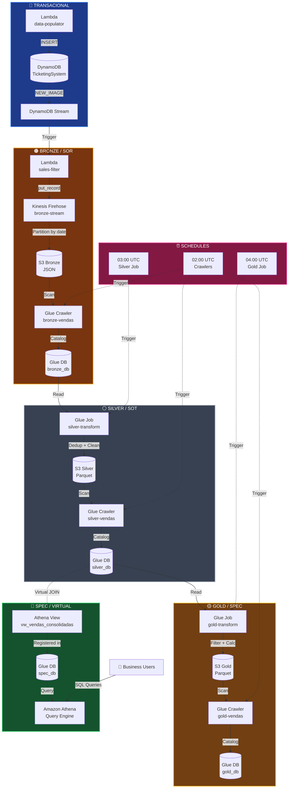
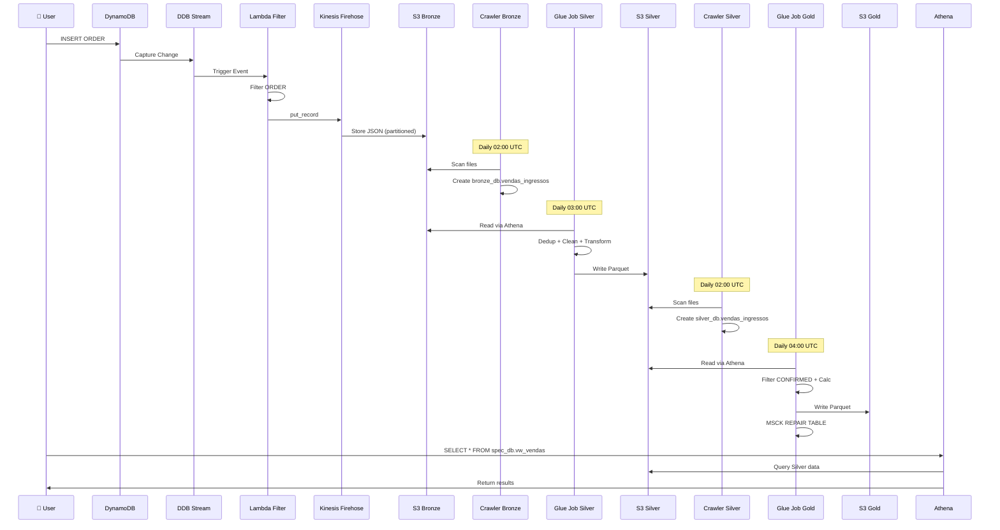
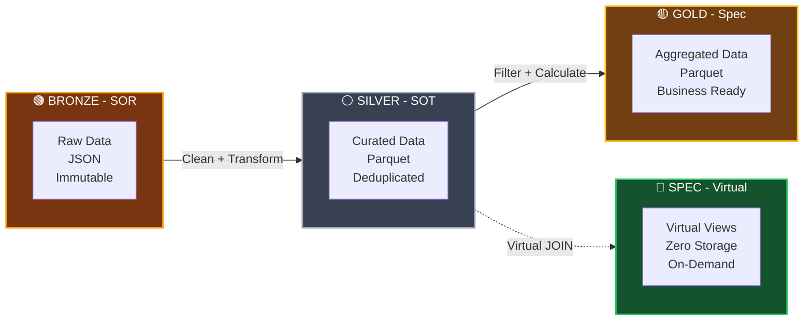
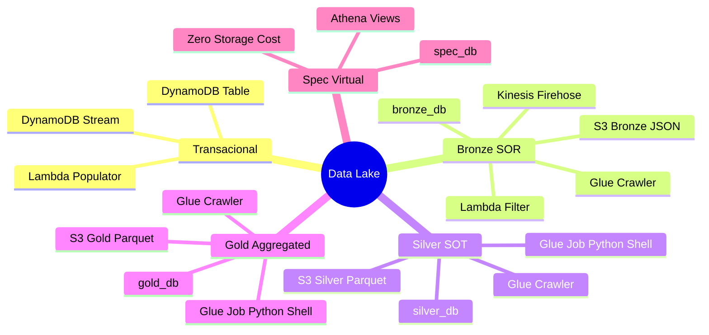
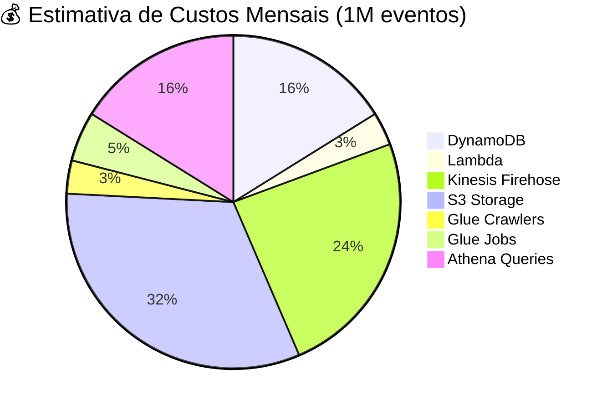

# 🎫 Arquitetura Data Lake - Diagrama Mermaid

## Diagrama Completo



## Fluxo de Dados Detalhado



## Arquitetura Medallion



## Componentes por Camada



## Timeline Diária

```mermaid
gantt
    title 📅 Pipeline Diário de Processamento
    dateFormat HH:mm
    axisFormat %H:%M
    
    section Real-time
    DynamoDB Stream → Lambda → Firehose → S3 Bronze :active, rt1, 00:00, 24h
    
    section Catalogação
    Crawlers (Bronze, Silver, Gold) :crit, c1, 02:00, 30m
    
    section Transformação
    Glue Job Silver (Bronze → Silver) :done, s1, 03:00, 1h
    Glue Job Gold (Silver → Gold) :done, g1, 04:00, 1h
    
    section Consulta
    Athena Views disponíveis 24/7 :active, a1, 00:00, 24h
```



## Custos por Serviço



---

## Como Visualizar

### No GitHub/GitLab
Os diagramas Mermaid são renderizados automaticamente em arquivos `.md`

### No VS Code
Instale a extensão: **Markdown Preview Mermaid Support**

### Online
Cole o código em: https://mermaid.live/

### Exportar PNG
```bash
# Instale mermaid-cli
npm install -g @mermaid-js/mermaid-cli

# Gere PNG
mmdc -i ARCHITECTURE.md -o architecture.png
```
